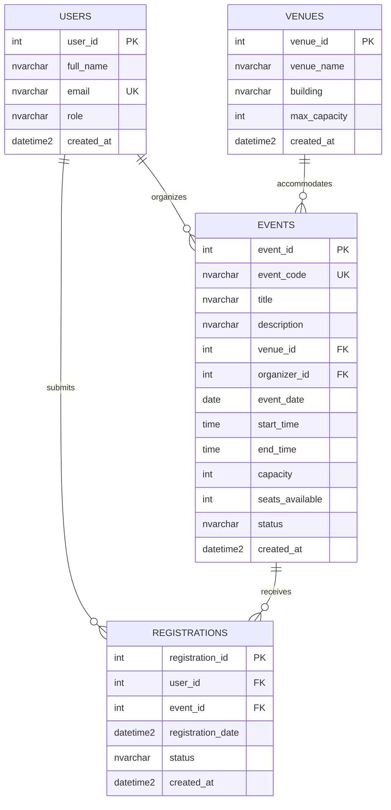

# Online Campus Event Management System

An accessible, robust web prototype and database architecture for managing campus events, student registrations, and administrative attendee tracking. Developed for **ITPE006LA - IT Professional Elective Lab Summative Examination**.

---

## 📋 Overview

The **Online Campus Event Management System** allows university students to browse upcoming campus events and register seamlessly, while enabling administrators and organizers to track attendee rosters in real-time.

Key objectives demonstrated in this repository:
- **WCAG 2.1 AA Accessibility & Semantic HTML5**: Accessible, screen-reader friendly user interface with high contrast and dynamic ARIA live region notifications.
- **Third Normal Form (3NF) Relational Database**: Strictly normalized database architecture separating Users, Venues, Events, and Registrations.
- **Production-Grade Data Integrity**: Enforced foreign key cascades and restraints, granular CHECK constraints, and optimized non-clustered indexes on foreign keys.

---

## 👥 Team Roster & Roles

| Role | Core Responsibilities |
|---|---|
| **Member 1 (Systems Architect & Prompt Lead)** | Task 1: Requirements Analysis & RCTC Prompting, Task 5: Documentation & Integration |
| **Member 2 (Frontend Engineer)** | Task 2: AI-Assisted Accessible UI & WCAG Implementation |
| **Member 3 (Database & Backend Engineer)** | Task 3: 3NF Relational Schema, Mermaid ERD, Production DDL Scripts, Task 4 Co-Lead |
| **Member 4 (QA & Security Engineer)** | Task 4: Shift-Left Unit Testing & Vulnerability Refactoring |

---

## 📂 Repository Structure

```text
ITPE006LA-IT-PROFESSIONAL-ELECTIVE-LAB-SUMMATIVE/
│
├── frontend/                     # Frontend Web Prototype (Task 2)
│   ├── index.html                # Semantic HTML5 markup with ARIA landmarks
│   ├── styles.css                # Accessible styling (WCAG 2.1 AA compliant)
│   └── script.js                 # Event rendering, form validation, and session attendee roster
│
├── database/                     # Database Architecture (Task 3)
│   └── schema.sql                # Production-grade 3NF DDL script with constraints, indexes & seeds
│
├── SUBMISSION.md                 # Consolidated Examination Report (Tasks 1-5, ERD & Verification Log)
└── README.md                     # Project overview and setup documentation
```

---

## 🚀 Quick Start Guide

### 1. Frontend Setup
The frontend is built with vanilla HTML, CSS, and JavaScript. No build step or package manager is required.

- **Option A (Direct File Opening)**:
  Double-click `frontend/index.html` to open it in your browser.
- **Option B (Local Web Server)**:
  ```bash
  # Using Python
  python -m http.server 3000 --directory frontend

  # Or using Node.js
  npx serve frontend
  ```
  Then navigate to `http://localhost:3000`.

### 2. Database Schema Deployment
The database script is located in [`database/schema.sql`](./database/schema.sql) and is compatible with Microsoft SQL Server, Azure SQL, and ANSI SQL engines.

1. Open SQL Server Management Studio (SSMS) or Azure Data Studio.
2. Connect to your database instance.
3. Open and execute `database/schema.sql`.
4. The script automatically creates:
   - Tables: `Users`, `Venues`, `Events`, `Registrations`
   - Constraints: Primary Keys, Foreign Keys, Unique Keys, and CHECK constraints
   - Non-Clustered Indexes: Foreign key lookups (`IX_Events_VenueId`, `IX_Registrations_UserId`, etc.)
   - Sample seed data matching the frontend catalog
   - Administrative reporting view: `dbo.vw_EventRegistrationOverview`

---

## 📊 Database Architecture (3NF ERD)



Detailed normalization justifications and verification records are documented in [`SUBMISSION.md`](./SUBMISSION.md).
