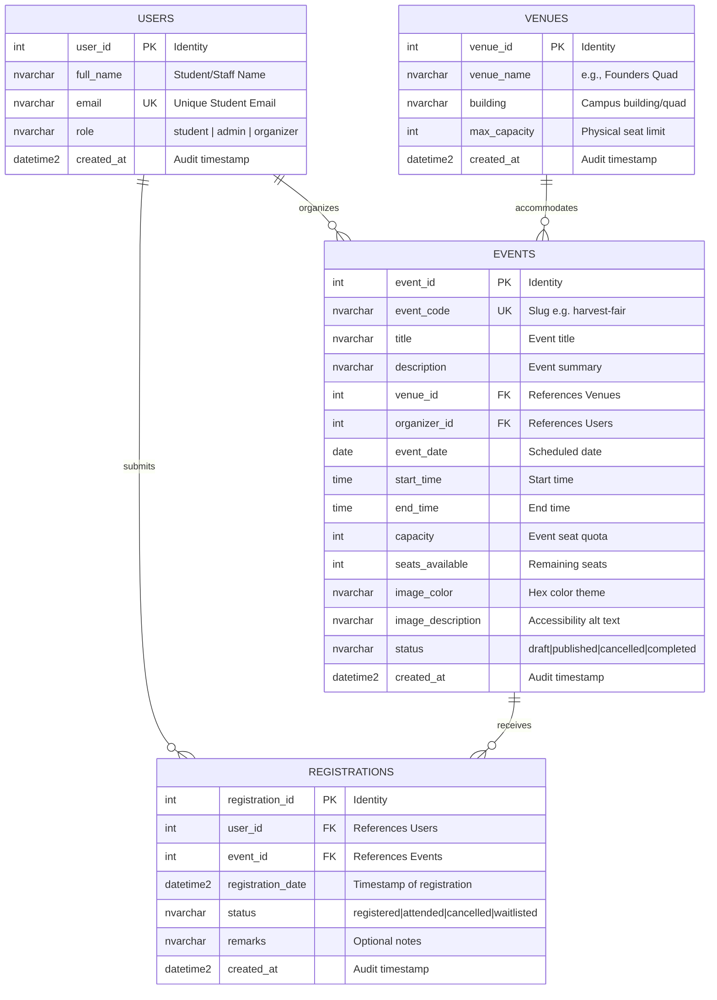

# Campus Event Management System
## Applied Generative AI for IT Solution Development — Laboratory Examination Report

---

## 1. Team Roster

| Member | Assigned Role | Primary Responsibilities |
|---|---|---|
| **Member 1** | Systems Architect & Prompt Lead | Task 1 (Requirements & RCTC Prompting), Task 5 (Documentation & Integration) |
| **Member 2 (Marc Jacob C. Lentejas)** | Frontend Engineer | Task 2 (AI-Assisted UI & WCAG 2.1 AA Accessibility) |
| **Member 3 (Aerrol Jimenez)** | Database & Backend Engineer | Task 3 (3NF Schemas, Mermaid.js ERD, Production DDL Scripts), Task 4 Co-Lead |
| **Member 4** | QA & Security Engineer | Task 4 (Shift-Left Unit Testing & Vulnerability Refactoring) |

---

## 2. Setup & Execution Instructions

### A. Frontend Prototype Setup
1. Navigate to the `/frontend` directory.
2. Open `index.html` in any modern web browser (Google Chrome, Mozilla Firefox, Microsoft Edge), or run a lightweight local HTTP server:
   ```bash
   # Option 1: Using Python
   python -m http.server 3000 --directory frontend

   # Option 2: Using Node.js npx serve
   npx serve frontend
   ```
3. Open `http://localhost:3000` to interact with the event catalog and registration form.

### B. Database Schema Setup
1. Open SQL Server Management Studio (SSMS), Azure Data Studio, or any ANSI SQL compatible query tool connected to your database instance.
2. Open and execute the script located at [`/database/schema.sql`](./database/schema.sql).
3. The script will:
   - Create tables `Users`, `Venues`, `Events`, and `Registrations` in 3rd Normal Form.
   - Enforce declarative constraints (Primary Keys, Foreign Keys with CASCADE/NO ACTION rules, and CHECK constraints).
   - Create non-clustered indexes on all foreign key columns.
   - Populate initial seed records matching the campus frontend prototype.
   - Create the reporting view `dbo.vw_EventRegistrationOverview`.

---

## ## Task 1: Requirements Analysis & Prompt Architecture
*(Lead: Member 1 - Systems Architect)*

### 1. RCTC Production-Grade Prompt
```text
[Role-Context-Task-Constraints (RCTC) Prompt to be documented by Member 1]
```

### 2. AI Output Architecture
```text
[AI architectural response to be recorded by Member 1]
```

### 3. Manual Grounding Evaluation
*[3–4 sentence evaluation verifying if the AI-generated architecture is realistic for a 3-hour team prototype]*

---

## ## Task 2: AI-Assisted Frontend Development
*(Lead: Member 2 - Frontend Engineer)*

- **Deliverables**: Committed in [`/frontend`](./frontend/)
  - [`frontend/index.html`](./frontend/index.html): Semantic HTML5 markup (`<header>`, `<main>`, `<section>`, `<article>`, `<footer>`).
  - [`frontend/styles.css`](./frontend/styles.css): High-contrast, WCAG-compliant responsive styling.
  - [`frontend/script.js`](./frontend/script.js): Dynamic client-side rendering, input validation, accessible live announcements (`aria-live`, `role="status"`), and attendee tracking.

- **Responsive behavior**: Included because the project requirements request a responsive layout. It is the same simple experience at all widths; small-screen rules reflow the event cards and keep the wide attendee table usable without making this a mobile-only design.
- **Verification**: Browser smoke testing confirmed six event cards, invalid-email feedback, successful registration, attendee-table updates, and seat-count updates. Keyboard tab order was checked as name, email, event, and submit. The page was checked at 320px with no horizontal overflow; the keyboard focus outline measures 5.35:1 against the page background.

---

## ## Task 3: Database Design & ERD Generation
*(Lead: Member 3 - Database Engineer)*

### 1. AI Prompt Used for Schema & ERD Generation
The following prompt was engineered using strict contextual parameters and negative constraints to generate a normalized 3NF database schema and Mermaid ERD:

```text
Act as a Principal Database Architect specializing in relational database design and high-performance SQL. 

Context:
We are developing a web-based Online Campus Event Management System where students view upcoming campus events, register for individual events, and administrators view registered attendees. The frontend tracks events (title, date, venue, capacity, seats available) and student registrations (full name, student email).

Task:
1. Design a relational database schema normalized to Third Normal Form (3NF) covering at least 4 entities: Users, Venues, Events, and Registrations.
2. Ensure strict adherence to 3NF by removing partial dependencies and transitive dependencies (e.g., isolating venue specifics and user accounts into dedicated entities).
3. Provide an Entity-Relationship Diagram (ERD) using valid Mermaid.js (erDiagram) code format.
4. Write a production-grade, ANSI/SQL Server compatible DDL script that includes:
   - Primary Keys with auto-increment/IDENTITY.
   - Foreign Key references with explicit referential integrity rules (CASCADE / NO ACTION).
   - Non-clustered indexes on all foreign key columns and critical query paths.
   - CHECK constraints validating data integrity (non-empty strings, valid email regex pattern, valid positive capacities, logical date/time ordering, and valid status enums).
   - A UNIQUE constraint preventing a student from registering twice for the same event.
   - Sample seed data matching the campus events prototype.

Negative Constraints:
- Do not store denormalized repeating groups or unseparated multi-attribute venue data inside the Events table.
- Do not omit indexes on foreign key columns.
```

---

### 2. 3NF Normalization Justification

The schema strictly fulfills **Third Normal Form (3NF)** requirements across all entities:

1. **First Normal Form (1NF)**:
   - **Atomic Attributes**: Every column holds non-divisible, scalar values (e.g., separate columns for `start_time` and `end_time` instead of combined strings; names and emails stored atomically).
   - **Unique Records**: Primary keys (`user_id`, `venue_id`, `event_id`, `registration_id`) are explicitly defined with clustered indexes.
   - **No Repeating Groups**: Registrations and event records are stored as individual relational rows rather than serialized arrays or comma-delimited fields.

2. **Second Normal Form (2NF)**:
   - Satisfies 1NF.
   - **Zero Partial Dependencies**: In tables with compound candidate keys (e.g., `Registrations` with candidate key `(user_id, event_id)`), all non-key attributes (`registration_date`, `status`, `remarks`) depend on the whole key rather than any individual subset. A surrogate primary key (`registration_id`) further eliminates any composite key partial dependency.

3. **Third Normal Form (3NF)**:
   - Satisfies 2NF.
   - **Zero Transitive Dependencies**: Non-key attributes depend solely on candidate keys ($X \rightarrow Y$ only where $X$ is a superkey):
     - **Separation of Venues**: In an unnormalized design, `Events` might include `venue_name`, `building`, and `venue_capacity`, which would create a transitive dependency (`event_id -> venue_name -> building`). This is resolved by isolating physical location data into the `Venues` table.
     - **Separation of Users & Registrations**: Student details (`full_name`, `email`) are decoupled from `Registrations`. The `Registrations` table only stores the foreign key `user_id`, preventing update anomalies when student contact information changes.
     - **Capacity & Registration Decoupling**: Dynamic seat calculations are maintained through transaction-safe constraints (`seats_available <= capacity`) and verifiable against count of active records in `Registrations`.

---

### 3. Visual ERD Deliverable (Mermaid.js)



---

### 4. Database DDL Script Summary

The production-grade DDL script is committed in [`/database/schema.sql`](./database/schema.sql). Key architectural highlights include:

- **Referential Integrity & Cascading Rules**:
  - `FK_Registrations_Users`: Cascades on update and delete (`ON UPDATE CASCADE ON DELETE CASCADE`) to preserve referential consistency when user records lifecycle ends.
  - `FK_Registrations_Events`: Cascades on update and delete (`ON UPDATE CASCADE ON DELETE CASCADE`) ensuring event cancellations appropriately handle associated registrations.
  - `FK_Events_Venues` & `FK_Events_Users_Organizer`: Configured with `ON DELETE NO ACTION` to prevent orphan events or unintended deletion of venues currently booked for active events.
- **Declarative CHECK Constraints**:
  - `CK_Users_Email_Format`: Validates standard email structure (`email LIKE '%_@__%.__%'`).
  - `CK_Users_Role_Valid`: Restricts roles to `'student'`, `'admin'`, or `'organizer'`.
  - `CK_Events_Capacity_Positive`: Enforces positive capacity quotas (`capacity > 0`).
  - `CK_Events_Seats_Range`: Enforces `seats_available >= 0 AND seats_available <= capacity`.
  - `CK_Events_TimeOrder`: Verifies chronological correctness (`end_time > start_time`).
  - `CK_Registrations_Status_Valid`: Validates states (`'registered'`, `'attended'`, `'cancelled'`, `'waitlisted'`).
- **Idempotency & Uniqueness**:
  - `UQ_Registrations_User_Event`: Guarantees that a student can only register once per specific event.
  - `UQ_Events_EventCode`: Ensures unique identifiers corresponding to URL-safe event slugs.
- **Non-Clustered Performance Indexes**:
  - `IX_Events_VenueId` on `Events(venue_id)` including `(title, event_date, status)`.
  - `IX_Events_OrganizerId` on `Events(organizer_id)`.
  - `IX_Registrations_UserId` on `Registrations(user_id)` including `(event_id, status)`.
  - `IX_Registrations_EventId` on `Registrations(event_id)` including `(user_id, status)`.
  - Composite covering index `IX_Events_Status_Date` on `Events(status, event_date)` for fast landing page queries.

---

## ## Task 4: Shift-Left Testing, Security & Refactoring
*(Lead: Member 4 - QA & Security Engineer / Co-Lead: Member 3)*

### 1. Intentionally Flawed Snippet Diagnostics
- **Vulnerability 1 (SQL Injection)**: The vulnerable code constructs SQL via string concatenation (`"SELECT * FROM Registrations WHERE Email = '" + inputEmail + "'"`), allowing arbitrary SQL execution via inputs such as `' OR '1'='1`.
- **Vulnerability 2 (Unmanaged Resource Leak)**: `SqlConnection` and `SqlCommand` instances were opened without `using` blocks or explicit `Dispose()` / `Close()`, leading to database connection pool exhaustion under load.

### 2. Unit Testing Strategy
- Unit tests with mock objects (e.g., Moq) isolating `IRegistrationRepository` to test domain validation (e.g., `@univ.edu.ph` email domain checks) and seat availability logic without requiring live SQL connections.

### 3. Refactored Implementation Deliverable
- Committed under [`/backend/RegistrationService.cs`](./backend/RegistrationService.cs).

---

## ## Task 5: Group Integration & Verification Report
*(Lead: Member 1 & Shared Team Review)*

### 1. AI Disclosure Statement
The team utilized AI tools (including Claude 3.5 Sonnet and Gemini models) as collaborative coding assistants during the laboratory exam. 
- **Prompt Engineering**: The team crafted explicit prompts containing strict system personas, contextual specifications, and negative constraints to generate initial codebases.
- **Verification Strategy**: All AI outputs were independently inspected, cross-checked against business rules, linted, and executed. Manual interventions were applied whenever generated code lacked essential production safeguards.

### 2. Group Verification Log Table

| Task # | Identified AI Flaw / Limitation | Manual Correction Applied | Member Responsible |
|---|---|---|---|
| **Task 2** | AI generated placeholder UI lacking accessible `aria-invalid` and `aria-live` error announcements on the registration form inputs. | Manually added accessible WCAG attributes, custom live regions, and semantic form error messaging. | Member 2 |
| **Task 3** | Initial AI schema output placed foreign keys on `Registrations` and `Events` but omitted non-clustered performance indexes and allowed unbounded seat counts. | Added explicit `CREATE NONCLUSTERED INDEX` scripts on all foreign key columns and implemented `CK_Events_Seats_Range` and `UQ_Registrations_User_Event` constraints. | Member 3 |
| **Task 4** | AI refactored code without applying asynchronous I/O (`ExecuteScalarAsync`) and omitted parameterized typed parameters with explicit sizes. | Added async C# `using` declaration blocks, parameterized `SqlParameter` with explicit type and size, and null-safe return value handling. | Member 4 / Member 3 |

---
