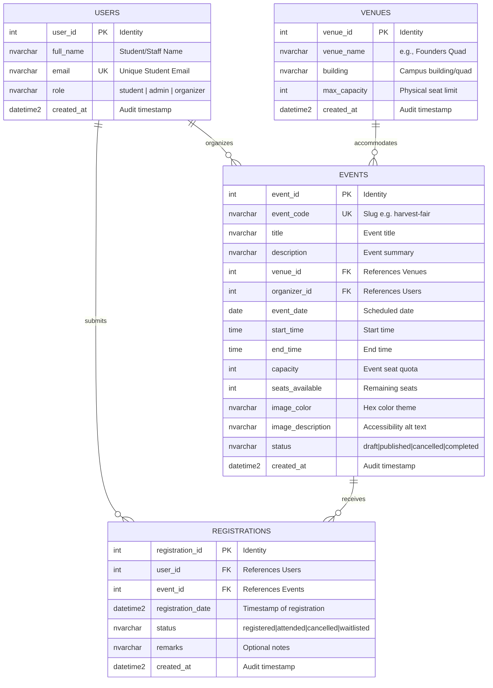

# Campus Event Management System
## Applied Generative AI for IT Solution Development — Laboratory Examination Report

---

## 1. Team Roster

| Member | Assigned Role | Primary Responsibilities |
|---|---|---|
| **Member 1 (Dylan Nicole)** | Systems Architect & Prompt Lead | Task 1 (Requirements & RCTC Prompting), Task 5 (Documentation & Integration) |
| **Member 2 (Marc Jacob C. Lentejas)** | Frontend Engineer | Task 2 (AI-Assisted UI & WCAG 2.1 AA Accessibility) |
| **Member 3 (Aerrol Jimenez)** | Database & Backend Engineer | Task 3 (3NF Schemas, Mermaid.js ERD, Production DDL Scripts), Task 4 Co-Lead |
| **Member 4 (Samuel D. Sambalilo Jr.)**| QA & Security Engineer | Task 4 (Shift-Left Unit Testing & Vulnerability Refactoring) |

---

## 2. Setup & Execution Instructions

### A. Frontend Prototype Setup
1. Navigate to the `/frontend` directory.
2. Open `index.html` in any modern web browser (Google Chrome, Mozilla Firefox, Microsoft Edge), or run a lightweight local HTTP server:
   ```bash
   # Option 1: Using Python
   python -m http.server 3000 --directory frontend

   # Option 2: Using Node.js npx serve
   npx serve frontend
   ```
3. Open `http://localhost:3000` to interact with the event catalog and registration form.

### B. Database Schema Setup
1. Open SQL Server Management Studio (SSMS), Azure Data Studio, or any ANSI SQL compatible query tool connected to your database instance.
2. Open and execute the script located at [`/database/schema.sql`](./database/schema.sql).
3. The script will:
   - Create tables `Users`, `Venues`, `Events`, and `Registrations` in 3rd Normal Form.
   - Enforce declarative constraints (Primary Keys, Foreign Keys with CASCADE/NO ACTION rules, and CHECK constraints).
   - Create non-clustered indexes on all foreign key columns.
   - Populate initial seed records matching the campus frontend prototype.
   - Create the reporting view `dbo.vw_EventRegistrationOverview`.

### C. Backend and Unit Tests
1. Install the [.NET 8 SDK](https://dotnet.microsoft.com/download/dotnet/8.0).
2. Open a terminal in the repository root.
3. Run the unit tests:
```bash
   dotnet test tests
```
4. For per-test output:
```bash
   dotnet test tests --logger "console;verbosity=normal"
```
5. The tests use Moq mocks, so they need no database connection.
6. The service code is in [`/backend/RegistrationService.cs`](./backend/RegistrationService.cs). To use `SqlRegistrationRepository` against a real database, pass the connection string from user-secrets or an environment variable. Do not hardcode it.

---

---

## Systems Architect

### Frontend Prompt

```text
Act as a Senior Frontend Engineer specializing in web accessibility.

Context: I'm building the frontend for a lightweight, local prototype of an Online Campus Event Management System. It will be built by a student team in 3 hours, so it must stay simple. Students can view upcoming campus events and register for one. Administrators can view the list of registered attendees.

Task: Create these files inside a /frontend folder: index.html, styles.css, and script.js. The page must include:

1. An Event Catalog: 6 hardcoded sample campus events as cards. Each card shows an image, title, date, venue, and seats left.
2. A Registration Form: full name, student email, and an event dropdown populated from the events. Include a submit button and an accessible success message.
3. A simple Admin section: a table listing registered attendees (name, email, event), updated when a registration is submitted. Keep the data in a plain JavaScript array in memory.

Constraints:

- Use plain HTML, CSS, and vanilla JavaScript only. Do not use frameworks or third-party libraries (no React, Redux, Bootstrap, Tailwind, jQuery).
- Do not add a backend, login, or external API calls. Mock data only.
- Use Semantic HTML5: <header>, <main>, <section>, <article>, <footer>. Each event card must be an <article>. Do not use <div> as a layout wrapper where a semantic tag fits.
- Accessibility (WCAG POUR):
  - Every input and select has a matching <label for="..."> AND an aria-label.
  - Every  has descriptive alt text.
  - Text/background colors meet WCAG AA contrast (4.5:1 or higher).
  - Visible keyboard focus styles and a logical tab order.
  - One <h1> and headings in proper order.
  - Form errors and success messages use aria-live.
- Validate that the email is in a valid format and show an accessible error message.
- Make the layout responsive.
- Use simple colored placeholder images (local or inline SVG), not external URLs.
- Use clear field names: fullName, email, eventId, title, eventDate, venue, seatsLeft.
```

## Frontend Engineer

- Added a six-event catalog using semantic `<article>` cards, hardcoded event data, and inline SVG placeholder images with descriptive alt text.
- Added a registration form with labeled name, email, and event controls; email validation announces errors accessibly, and successful registration announces confirmation.
- Kept registrations in a plain JavaScript array in memory. Submissions update the admin attendee table and the selected event's remaining seat count.
- Added visible keyboard focus, AA-contrast text colors, one `<h1>` with ordered headings, and responsive layout behavior as required by the prompt.
- Tested the browser tab order, invalid and valid email submissions, attendee-table updates, seat updates, and the layout at a 320px viewport.

---

## ## Task 2: AI-Assisted Frontend Development
*(Lead: Member 2 - Frontend Engineer)*

- **Deliverables**: Committed in [`/frontend`](./frontend/)
  - [`frontend/index.html`](./frontend/index.html): Semantic HTML5 markup (`<header>`, `<main>`, `<section>`, `<article>`, `<footer>`).
  - [`frontend/styles.css`](./frontend/styles.css): High-contrast, WCAG-compliant responsive styling.
  - [`frontend/script.js`](./frontend/script.js): Dynamic client-side rendering, input validation, accessible live announcements (`aria-live`, `role="status"`), and attendee tracking.

- **Responsive behavior**: Included because the project requirements request a responsive layout. It is the same simple experience at all widths; small-screen rules reflow the event cards and keep the wide attendee table usable without making this a mobile-only design.
- **Verification**: Browser smoke testing confirmed six event cards, invalid-email feedback, successful registration, attendee-table updates, and seat-count updates. Keyboard tab order was checked as name, email, event, and submit. The page was checked at 320px with no horizontal overflow; the keyboard focus outline measures 5.35:1 against the page background.

---

## ## Task 3: Database Design & ERD Generation
*(Lead: Member 3 - Database Engineer)*

### 1. AI Prompt Used for Schema & ERD Generation
The following prompt was engineered using strict contextual parameters and negative constraints to generate a normalized 3NF database schema and Mermaid ERD:

```text
Act as a Principal Database Architect specializing in relational database design and high-performance SQL. 

Context:
We are developing a web-based Online Campus Event Management System where students view upcoming campus events, register for individual events, and administrators view registered attendees. The frontend tracks events (title, date, venue, capacity, seats available) and student registrations (full name, student email).

Task:
1. Design a relational database schema normalized to Third Normal Form (3NF) covering at least 4 entities: Users, Venues, Events, and Registrations.
2. Ensure strict adherence to 3NF by removing partial dependencies and transitive dependencies (e.g., isolating venue specifics and user accounts into dedicated entities).
3. Provide an Entity-Relationship Diagram (ERD) using valid Mermaid.js (erDiagram) code format.
4. Write a production-grade, ANSI/SQL Server compatible DDL script that includes:
   - Primary Keys with auto-increment/IDENTITY.
   - Foreign Key references with explicit referential integrity rules (CASCADE / NO ACTION).
   - Non-clustered indexes on all foreign key columns and critical query paths.
   - CHECK constraints validating data integrity (non-empty strings, valid email regex pattern, valid positive capacities, logical date/time ordering, and valid status enums).
   - A UNIQUE constraint preventing a student from registering twice for the same event.
   - Sample seed data matching the campus events prototype.

Negative Constraints:
- Do not store denormalized repeating groups or unseparated multi-attribute venue data inside the Events table.
- Do not omit indexes on foreign key columns.
```

---

### 2. 3NF Normalization Justification

The schema strictly fulfills **Third Normal Form (3NF)** requirements across all entities:

1. **First Normal Form (1NF)**:
   - **Atomic Attributes**: Every column holds non-divisible, scalar values (e.g., separate columns for `start_time` and `end_time` instead of combined strings; names and emails stored atomically).
   - **Unique Records**: Primary keys (`user_id`, `venue_id`, `event_id`, `registration_id`) are explicitly defined with clustered indexes.
   - **No Repeating Groups**: Registrations and event records are stored as individual relational rows rather than serialized arrays or comma-delimited fields.

2. **Second Normal Form (2NF)**:
   - Satisfies 1NF.
   - **Zero Partial Dependencies**: In tables with compound candidate keys (e.g., `Registrations` with candidate key `(user_id, event_id)`), all non-key attributes (`registration_date`, `status`, `remarks`) depend on the whole key rather than any individual subset. A surrogate primary key (`registration_id`) further eliminates any composite key partial dependency.

3. **Third Normal Form (3NF)**:
   - Satisfies 2NF.
   - **Zero Transitive Dependencies**: Non-key attributes depend solely on candidate keys ($X \rightarrow Y$ only where $X$ is a superkey):
     - **Separation of Venues**: In an unnormalized design, `Events` might include `venue_name`, `building`, and `venue_capacity`, which would create a transitive dependency (`event_id -> venue_name -> building`). This is resolved by isolating physical location data into the `Venues` table.
     - **Separation of Users & Registrations**: Student details (`full_name`, `email`) are decoupled from `Registrations`. The `Registrations` table only stores the foreign key `user_id`, preventing update anomalies when student contact information changes.
     - **Capacity & Registration Decoupling**: Dynamic seat calculations are maintained through transaction-safe constraints (`seats_available <= capacity`) and verifiable against count of active records in `Registrations`.

---

### 3. Visual ERD Deliverable (Mermaid.js)



---

### 4. Database DDL Script Summary

The production-grade DDL script is committed in [`/database/schema.sql`](./database/schema.sql). Key architectural highlights include:

- **Referential Integrity & Cascading Rules**:
  - `FK_Registrations_Users`: Cascades on update and delete (`ON UPDATE CASCADE ON DELETE CASCADE`) to preserve referential consistency when user records lifecycle ends.
  - `FK_Registrations_Events`: Cascades on update and delete (`ON UPDATE CASCADE ON DELETE CASCADE`) ensuring event cancellations appropriately handle associated registrations.
  - `FK_Events_Venues` & `FK_Events_Users_Organizer`: Configured with `ON DELETE NO ACTION` to prevent orphan events or unintended deletion of venues currently booked for active events.
- **Declarative CHECK Constraints**:
  - `CK_Users_Email_Format`: Validates standard email structure (`email LIKE '%_@__%.__%'`).
  - `CK_Users_Role_Valid`: Restricts roles to `'student'`, `'admin'`, or `'organizer'`.
  - `CK_Events_Capacity_Positive`: Enforces positive capacity quotas (`capacity > 0`).
  - `CK_Events_Seats_Range`: Enforces `seats_available >= 0 AND seats_available <= capacity`.
  - `CK_Events_TimeOrder`: Verifies chronological correctness (`end_time > start_time`).
  - `CK_Registrations_Status_Valid`: Validates states (`'registered'`, `'attended'`, `'cancelled'`, `'waitlisted'`).
- **Idempotency & Uniqueness**:
  - `UQ_Registrations_User_Event`: Guarantees that a student can only register once per specific event.
  - `UQ_Events_EventCode`: Ensures unique identifiers corresponding to URL-safe event slugs.
- **Non-Clustered Performance Indexes**:
  - `IX_Events_VenueId` on `Events(venue_id)` including `(title, event_date, status)`.
  - `IX_Events_OrganizerId` on `Events(organizer_id)`.
  - `IX_Registrations_UserId` on `Registrations(user_id)` including `(event_id, status)`.
  - `IX_Registrations_EventId` on `Registrations(event_id)` including `(user_id, status)`.
  - Composite covering index `IX_Events_Status_Date` on `Events(status, event_date)` for fast landing page queries.

---

## ## Task 4: Shift-Left Testing, Security & Refactoring
*(Lead: Member 4 - QA & Security Engineer)*

### 1. AI Prompt Used

The prompt follows the RCTC format. It sets a persona, gives the table schema as context, and lists negative constraints.

```text
Act as a Senior QA & Application Security Engineer specializing in C#/.NET, secure data access, and shift-left unit testing.

Context:
I'm Member 4 on a student team building an Online Campus Event Management System (3-hour lab prototype). The backend is C# with SQL Server. Relevant tables (already created):
- dbo.Users(user_id INT PK, full_name NVARCHAR(100), email NVARCHAR(255) UNIQUE, role NVARCHAR(20))
- dbo.Events(event_id INT PK, event_code NVARCHAR(50), title NVARCHAR(200), capacity INT, seats_available INT, status NVARCHAR(20))
- dbo.Registrations(registration_id INT PK, user_id INT FK, event_id INT FK, registration_date DATETIME2, status NVARCHAR(20)) with a unique (user_id, event_id)
Note: Registrations has NO Email column; email is in Users, so the query must JOIN Users and Registrations.

Here is an intentionally flawed method I must fix:

// Flawed code: Contains SQL Injection and unmanaged resource leak
public string GetUserRegistration(string inputEmail) {
    string connStr = "Server=myServerAddress;Database=myDataBase;User Id=myUsername;Password=myPassword;";
    SqlConnection conn = new SqlConnection(connStr);
    conn.Open(); // Connection is not closed or disposed
    SqlCommand cmd = new SqlCommand("SELECT * FROM Registrations WHERE Email = '" + inputEmail + "'", conn);
    return cmd.ExecuteScalar().ToString();
}

Task (do these in order, with a clear heading for each):
1. DIAGNOSE: List every vulnerability and bad practice in the snippet above: the SQL injection (include an example malicious input and what it would do), the unmanaged resource leak (SqlConnection and SqlCommand never disposed, and what it causes under load, such as connection pool exhaustion), the hardcoded credentials, SELECT * with ExecuteScalar, and the NullReferenceException when no row is found. Rate each by severity.
2. REFACTOR: Rewrite it as /backend/RegistrationService.cs (C#, .NET 8, Microsoft.Data.SqlClient). Requirements:
   - Define an interface IRegistrationRepository (e.g., GetRegistrationStatusByEmail(string email), GetSeatsAvailable(int eventId)) and put the SQL access in a SqlRegistrationRepository class.
   - In the repository, use a parameterized query (SqlParameter with explicit SqlDbType.NVarChar and size 255), JOIN Users and Registrations, select only the needed column, and wrap SqlConnection and SqlCommand (and any reader) in `using` statements.
   - Read the connection string from IConfiguration or an injected value, never hardcoded.
   - Return null (or a clear "not found" result) instead of throwing when there is no match; make it null-safe.
   - Create a RegistrationService class that receives IRegistrationRepository through constructor injection and exposes GetUserRegistration(string inputEmail), plus two validation routines: IsValidStudentEmail (domain must be @univ.edu.ph) and HasSeatsAvailable(int eventId).
   - Add short comments explaining each security fix.
3. UNIT TESTS: Write xUnit tests using Moq to mock IRegistrationRepository so no real database is touched. Cover at minimum:
   - Email validation: valid @univ.edu.ph, wrong domain, null/empty/whitespace, mixed case, a lookalike domain such as name@univ.edu.ph.evil.com, and a SQL injection string such as ' OR '1'='1.
   - Seat availability: seats > 0, seats = 0, event not found, and negative values.
   - GetUserRegistration: registration exists, not found (returns null), and verify with Moq that the repository is called exactly once with the exact email passed in.
   Use the Arrange-Act-Assert pattern and descriptive test names.

Constraints:
- Do not build any SQL by string concatenation or string interpolation.
- Do not hardcode credentials or connection strings.
- Do not call a real database in the unit tests; use mocks only.
- Do not use SELECT *.
- Do not leave any SqlConnection, SqlCommand, or SqlDataReader undisposed.
- Do not use third-party libraries beyond xUnit, Moq, and Microsoft.Data.SqlClient.
- Do not skip any of the three tasks, and keep explanations short and practical.

Output format: three sections (Diagnosis as a table, Refactored RegistrationService.cs as one code block, Unit tests as one code block), and finish with a bullet list of the exact commands to run the tests (dotnet test).
```

### 2. AI Output: Diagnosis

| # | Issue | What happens | Severity |
|---|---|---|---|
| 1 | **SQL injection** (string concatenation) | Input `' OR '1'='1` makes the query `WHERE Email = '' OR '1'='1'`, which matches every row. Input `x'; DROP TABLE Registrations;--` ends the statement and runs a second one. | **Critical** |
| 2 | **Resource leak** (`SqlConnection` and `SqlCommand` never disposed) | Each call holds a pooled connection until garbage collection. The default pool holds 100 connections. Under load the pool runs out and callers time out. | **High** |
| 3 | **Hardcoded credentials** | The password sits in source code and Git history. Rotating it needs a code change. | **High** |
| 4 | **Wrong schema in query** | `Registrations` has no `Email` column, so the query fails at runtime. The email lives in `Users`. | **Medium** |
| 5 | **`NullReferenceException`** | `ExecuteScalar()` returns `null` when no row matches, and `.ToString()` on `null` throws. | **Medium** |
| 6 | **`SELECT *` with `ExecuteScalar`** | `ExecuteScalar` reads only the first column of the first row, so the result is arbitrary. | **Low** |
| 7 | **No input validation or layering** | Nothing checks the email. SQL and logic share one method, so it cannot be tested without a database. | **Low** |

### 3. AI Output: Refactored Code and Tests

- **Refactored code:** [`/backend/RegistrationService.cs`](./backend/RegistrationService.cs)
  - `IRegistrationRepository` and `SqlRegistrationRepository` hold the SQL access.
  - Parameterized queries use `SqlDbType.NVarChar` at size 255 for email and `SqlDbType.Int` for the event ID.
  - `await using` declarations dispose the connection and command, and the async methods use `OpenAsync` and `ExecuteScalarAsync`.
  - The query joins `Users` and `Registrations` and selects one column.
  - The connection string is injected. No credentials appear in code.
  - Missing rows return `null` instead of throwing.
  - `RegistrationService` takes the repository through its constructor. It exposes `GetUserRegistrationAsync`, `IsValidStudentEmail`, and `HasSeatsAvailableAsync`.
- **Unit tests:** [`/tests/RegistrationServiceTests.cs`](./tests/RegistrationServiceTests.cs)
  - xUnit with Moq. A strict mock replaces `IRegistrationRepository`, so no test touches a database.
  - Email cases: valid, mixed case, wrong domain, null/empty/whitespace, lookalike domains, and SQL injection strings.
  - Seat cases: more than 0, 0, event not found, and negative values.
  - Registration cases: found, not found, and one repository call with the exact email. Invalid emails never reach the repository.

### 4. How to Run the Tests

```bash
dotnet test tests
```

- **Test result:** All 35 tests passed (0 failed, 0 skipped) via dotnet test tests
- **Tested by:** Samuel D. Sambalilo Jr.

### 5. Manual Verification

- **Checked against the schema:** the query uses the real `dbo.Users` and `dbo.Registrations` columns from `/database/schema.sql`. The test emails match the seed data.
- **Refinement:** the first refactor used synchronous `Open()` and `ExecuteReader()`. The team changed it to async I/O with `await using`.
- **Limit:** `SqlRegistrationRepository` needs a live SQL Server, so the mock-only tests do not cover it.
---

## ## Task 5: Group Integration & Verification Report
*(Lead: Member 1 & Shared Team Review)*

### 1. AI Disclosure Statement
The team utilized AI tools (including Claude 3.5 Sonnet and Gemini models) as collaborative coding assistants during the laboratory exam. 
- **Prompt Engineering**: The team crafted explicit prompts containing strict system personas, contextual specifications, and negative constraints to generate initial codebases.
- **Verification Strategy**: All AI outputs were independently inspected, cross-checked against business rules, linted, and executed. Manual interventions were applied whenever generated code lacked essential production safeguards.

### 2. Group Verification Log Table

| Task # | Identified AI Flaw / Limitation | Manual Correction Applied | Member Responsible |
|---|---|---|---|
| **Task 2** | AI generated placeholder UI lacking accessible `aria-invalid` and `aria-live` error announcements on the registration form inputs. | Manually added accessible WCAG attributes, custom live regions, and semantic form error messaging. | Member 2 |
| **Task 3** | Initial AI schema output placed foreign keys on `Registrations` and `Events` but omitted non-clustered performance indexes and allowed unbounded seat counts. | Added explicit `CREATE NONCLUSTERED INDEX` scripts on all foreign key columns and implemented `CK_Events_Seats_Range` and `UQ_Registrations_User_Event` constraints. | Member 3 |
| **Task 4** | The first AI refactor used synchronous I/O (`Open()` and `ExecuteReader()`). It also used a generic `CampusEvents` namespace that did not match the repository. | Rewrote the repository methods with `OpenAsync()`, `ExecuteScalarAsync()`, and `await using` declarations. Renamed the namespaces to `CampusEventManagement.Backend` and `CampusEventManagement.Tests`. Confirmed the query uses the real column names from `schema.sql`. | Member 4 |
